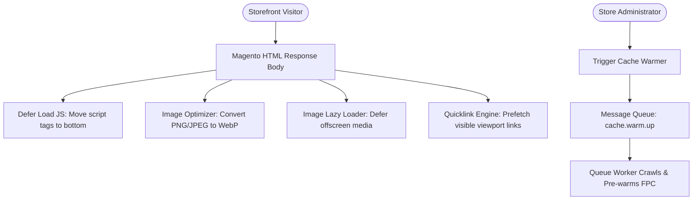

# Introduction

Webstore speed and performance optimization is critical for increasing the performance and conversion rates of E-commerce websites. That’s why Webkul has developed the **Magento 2 Store Optimization (Adobe Commerce)** extension — an all-in-one performance suite designed to boost Google PageSpeed Insights scores, decrease page load latency, and enhance user engagement across both desktop and mobile storefronts.

The main purpose behind optimizing the store is to deliver a superior user experience, especially when operating on the Adobe Commerce platform. Since Adobe Commerce Cloud is a feature-rich, heavy platform, operating without proper website optimization can lead to slow loading speeds and friction for customers.

The **Magento 2 Store Optimization** extension addresses these challenges by combining WebP and JPEG image compression, script deferral, infinite catalog pagination, offscreen image lazy loading, viewport link prefetching, and message-queue-backed background cache warming.

::: tip Related Media & Content Optimization Modules
* **Image Moderation**: Check and manage image appropriateness prior to uploading using the **Magento 2 Indecent Content Checker** extension.
* **Cloud Storage Offloading**: Optimize server storage by offloading product and CMS media content via the **Magento 2 Digital Ocean Storage** extension so media is served directly from Digital Ocean servers.
:::

---

## Technical Architecture

---

## Key Features & Benefits

* **Google PageSpeed & Performance Optimization**: Significantly enhances Core Web Vitals (FCP, LCP, CLS) and overall website speed ratings.
* **Image Compression (WebP / JPEG)**: Converts product, category, and CMS images to optimized `.webp` or `.jpeg` formats for faster loading rates and reduced bandwidth.
* **Configurable Compressed Image Quality**: Fine-tune compressed image quality (0–100) to balance visual quality and file size.
* **Flexible Encoding Types**: Supports Auto, Lossy, and Lossless encoding algorithms.
* **Responsive Pixels Configuration**: Admin can enter a comma-separated list of responsive pixels for targeted device optimization.
* **Fetch Priority Attribute Management**: Manages fetch priority attributes on critical storefront images for faster Largest Contentful Paint (LCP).
* **Defer Loading JS**: Rearranges non-critical JavaScript tags to the bottom of the HTML page to eliminate render-blocking scripts.
* **Infinite Scroller**: Enables continuous product scrolling on category and search pages to display catalog products on a single seamless view.
* **Image Lazy Loader**: Defers loading offscreen media until items scroll near the customer's active viewport.
* **Public Page Cache Warmer**: Asynchronously pre-warms Full Page Cache (FPC) across public store pages using background message queues.
* **CLI Mass Image Conversion**: Execute terminal commands to recursively convert mass images across CMS and media directories to `.webp` or `.jpeg`.
* **Varnish & Redis Compatibility**: Operates seamlessly with Adobe Commerce caching architectures including Varnish and Redis.
* **Google Quicklink Integration**: Prefetches visible viewport links during idle browser time for instant page transitions.
