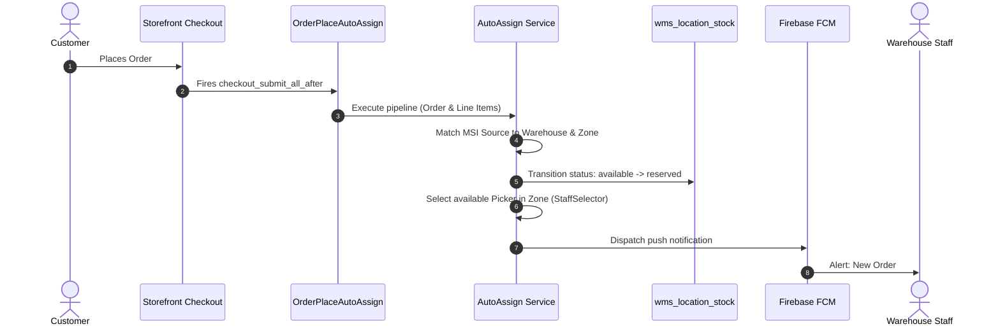

# General Settings

The **General** configuration tab controls automated fulfillment routing when customers complete orders on the storefront.

## Fields

| Field | Description | Default |
| --- | --- | --- |
| **Enable Order Auto Assignment** | Toggles automated background order routing upon successful checkout. | **No** |

## How Order Auto-Assignment Works

When set to **Yes**, WMS triggers an automated routing pipeline immediately after an order is persisted to the database:

### Why `checkout_submit_all_after`?

Unlike Magento's standard `sales_order_place_after` event (which fires *before* the order entity and line items are committed to the database and lack an `entity_id`), WMS listens to `checkout_submit_all_after`. This ensures:
- The order has an authentic increment ID and entity ID.
- Order line items are fully persisted before assigning them to warehouse bins.
- No partial or orphaned assignments occur if checkout validation fails.

::: tip Manual Assignment Fallback
If **Enable Order Auto Assignment** is set to **No**, all incoming orders arrive in state **Not Assigned**. You can manually assign line items to warehouses and pickers under **Sales &rarr; Orders &rarr; View &rarr; Order Assign**. See [Order Auto-Assignment](/features/order-assignment.html).
:::
