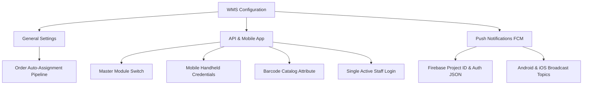

# Configuration Overview

Configure global WMS behaviors under **Stores &rarr; Configuration &rarr; Webkul &rarr; Warehouse Management System**.

Settings are split across three primary operational groups:



## Section Summary

| Group | Key Settings | Documentation |
| --- | --- | --- |
| **General** | Order Auto-Assignment toggle (`checkout_submit_all_after` pipeline). | [Open General Settings](/configuration/general-settings.html) |
| **API Configuration** | Master module switch, mobile API tokens, barcode attribute, layout themes, and single login enforcement. | [Open API & Mobile Settings](/configuration/api-mobile-settings.html) |
| **Push Notifications** | Firebase Project ID, service account JSON key, and Android/iOS topic channels. | [Open Push Notifications](/configuration/push-notifications.html) |

## Configuration Scope

All WMS configurations are managed at the **Global (Default Config)** scope by default. This ensures uniform picking protocols, barcode definitions, and warehouse assignments across all your storefronts and websites.

Flush the cache whenever configuration changes are saved:

```bash
php bin/magento cache:flush
```
