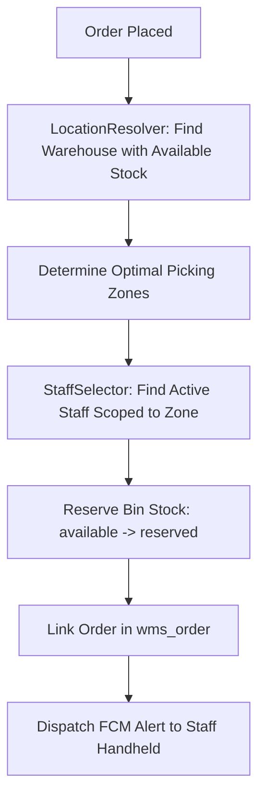

# Order Assignment & Routing

WMS manages how customer orders transition from placed sales to physically picked line items.

## Manage Orders Grid

Navigate to **Warehouse Management System &rarr; Manage Orders** to review assignment states across all fulfillment centers:

| Column | Description |
| --- | --- |
| **ID** | Internal WMS order assignment record ID. |
| **Increment ID** | Magento Sales Order number (e.g. `#000000142`). |
| **Warehouse** | Facility fulfilling this order. |
| **Staff** | Assigned picker responsible for gathering line items. |
| **Assigned Totes** | Physical barcode containers currently assigned to the order. |
| **Order Status** | Magento sales order state (`Pending`, `Processing`, `Complete`). |
| **Assignment State** | Current assignment status (`Assigned` or `Not Assigned`). |
| **Action** | Direct link to **View Order** details. |

## Manual Assignment via Sales Order View

If an order was not auto-assigned (or requires reassignment to a different warehouse/staff member), admins can route line items manually:

1. In the admin menu, open **Sales &rarr; Orders**.
2. Click **View** on the order you want to route.
3. In the left navigation tabs, select **Order Assign (WMS)**.

### Assignment Workflow:
1. Review the ordered product line items and quantities.
2. Under **Warehouse**, choose the facility containing physical stock for each item.
3. Under **Staff**, select an active picker stationed in that warehouse.
4. Click **Assign Order** in the upper-right corner.

Upon clicking **Assign Order**:
- An assignment record is created in `wms_order`.
- Bin stock for the ordered quantities moves from `available` to `reserved` in `wms_location_stock`.
- A real-time push notification is dispatched to the chosen picker's mobile device.

## Automated Routing Pipeline

When **Enable Order Auto Assignment** is turned on in [General Settings](/configuration/general-settings.html), WMS evaluates the following steps on every checkout:

1. **LocationResolver:** Identifies the warehouse and physical bin holding available stock for each line item.
2. **StaffSelector:** Queries active staff members whose zone permissions (`wms_staff_zone`) match the target bin's zone. If multiple pickers are eligible, WMS selects the picker with the lowest active queue.
3. **Reservation:** Locks bin stock in `wms_location_stock` so no concurrent orders can claim the same physical inventory.
4. **Notification:** Sends an immediate push payload to the picker's handheld device.
