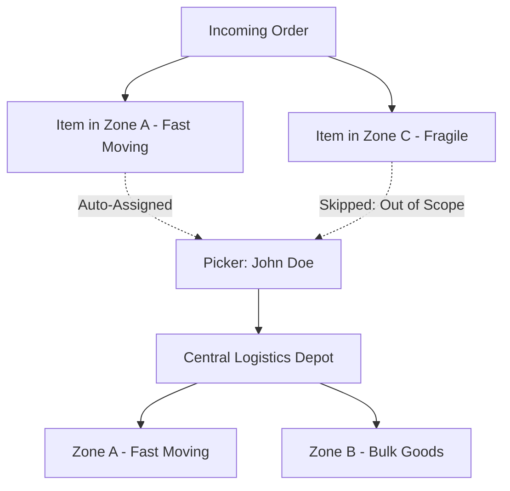

# Staff & Pickers Management

Manage warehouse personnel, picker authentication credentials, and zone access rules under **Warehouse Management System &rarr; Manage Staff**.

## Staff Listing Grid

The staff table displays all registered pickers and their facility assignments:

| Column | Description |
| --- | --- |
| **ID** | Staff entity identifier (`wms_warehouse_staff.staff_id`). |
| **Staff Name** | Name of the warehouse worker or picker. |
| **Email Address** | Worker login email for the mobile application. |
| **Contact Number** | Phone number for internal operations and alerts. |
| **Warehouse** | Facility where the staff member is stationed. |
| **Scoped Zones** | Logical warehouse zones where this picker is permitted to work. |
| **Status** | Active status (**Active** or **Disabled**). |
| **Action** | Edit staff profile and permissions. |

## Creating a Staff Account

Click **Add Staff** in the upper-right corner:

### Form Fields & Permissions

| Field | Required | Description |
| --- | --- | --- |
| **Avatar Image** | No | Profile photo displayed in the mobile picker interface. |
| **Staff Name** | Yes | Full name of the employee. |
| **Staff Email** | Yes | Unique login username for mobile handheld terminals. |
| **Password / Confirm** | Yes | Secure password used to authenticate via GraphQL / REST. |
| **Contact Number** | Yes | Emergency or operational contact phone number. |
| **Date of Birth & Gender** | Yes | Employee demographic records. |
| **Assigned Warehouse** | Yes | Selects the facility where this worker operates. |
| **Assigned Zones** | Yes | Multiselect list defining the zones this picker can service. |
| **Status** | Yes | Enabled allows mobile login; Disabled revokes terminal access. |

## Zone Scoping (`wms_staff_zone`)

In large warehouses, workers specialize in specific zones (e.g. cold storage, bulk heavy goods, or high-value electronics):

- When an order requires items from **Zone A**, WMS queries `wms_staff_zone` to find pickers explicitly permitted to enter Zone A.
- Pickers will not receive tasks or push notifications for zones outside their assigned scope.
- If a picker is cross-trained across multiple zones, select multiple zones in the **Assigned Zones** multiselect field.
