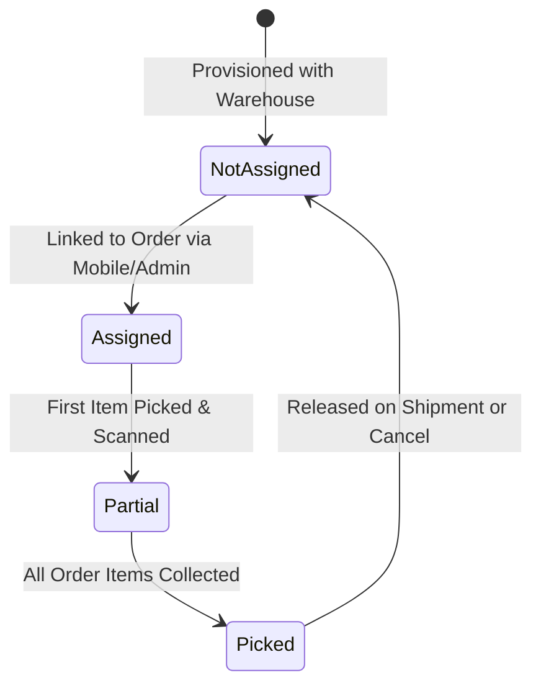

# Totes & Barcode Picking

Totes are reusable physical plastic bins or carts carried by pickers on the warehouse floor. WMS tracks each tote using unique Code128 barcodes to ensure items for different orders are never mixed together.

## Manage Tote Grid

Navigate to **Warehouse Management System &rarr; Manage Tote**:

| Column | Description |
| --- | --- |
| **ID** | Internal database record ID (`wms_tote.id`). |
| **Title** | Unique identifier stamped on the physical tote (e.g. `TOTE-001`). |
| **Warehouse** | Warehouse facility where the tote is stationed. |
| **Zone** | Default zone or staging area for the container. |
| **Cashier / Staff** | Currently logged-in picker carrying this container. |
| **Assignment State** | `Assigned` (linked to an active order) or `Not Assigned` (free for use). |
| **Pick Status** | Progress of items collected into this tote: `Not Picked`, `Partial`, or `Picked`. |
| **Assigned Order** | Magento order increment ID currently utilizing this tote. |
| **Bar Code** | Rendered Code128 barcode image generated by PHP Imagick. |
| **Action** | Direct link to print individual barcode label. |

## Printing Tote Barcode Labels

To affix scannable labels to your physical totes:

1. In the **Manage Tote** grid, select the checkboxes for the totes you wish to label (or choose **Select All**).
2. Click **Mass Print Barcode** in the top action toolbar.
3. WMS renders a print-optimized label sheet formatted for standard thermal label printers and laser sticker sheets:

Each label features:
- Tote Title and Facility Name
- Default Zone assignment
- High-contrast Code128 scannable barcode
- Human-readable text for manual fallbacks

## Printing Product Barcodes

Under **Warehouse Management System &rarr; Manage Warehouse &rarr; Barcodes**, generate shelf and product labels:

- Generated dynamically from the catalog attribute configured in [API & Mobile Settings](/configuration/api-mobile-settings.html) (default: `SKU`).
- High-resolution horizontal barcode output generated via `Helper\Barcode::generatebarcode()`.
- Includes Product Name, SKU, Price, and physical bin address for easy stock placement.

## Tote Release Lifecycle

1. **Auto-Release:** When an order is fully shipped or cancelled, `ToteReleaseManager` resets `assignment_state` to `not_assigned`, deletes entries in `wms_order_totes`, and frees the container for the next order.
2. **Manual Force Release:** If a tote is misplaced or an order is put on hold, click **Free Selected Totes** in the tote grid toolbar to immediately disassociate the tote and make it available again.
