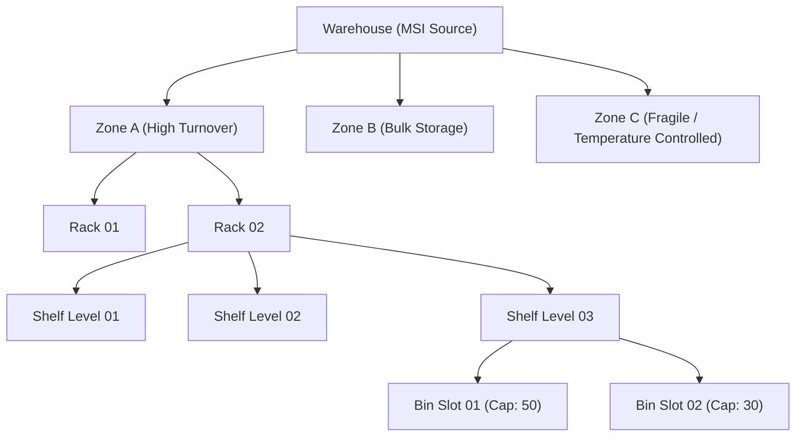

# Zones & Physical Locations

Modern warehouses require organized spatial zoning to minimize picker travel distance and optimize order fulfillment speeds.

## 5-Tier Location Model

WMS organizes every physical facility using a five-tier address structure:

1. **Warehouse (`wms_warehouse`):** The top-level facility linked to an MSI inventory source.
2. **Zone (`wms_zone`):** Logical division inside the building (e.g. Zone A, Zone B, Refrigerated, Hazmat).
3. **Row / Column:** Floor layout coordinates specifying aisle paths.
4. **Rack & Shelf:** Vertical racking structures with numbered shelf tiers.
5. **Bin (`wms_product_location`):** The final physical bin slot where products are placed.

## Coordinate Address Standard

WMS generates canonical barcode addresses for every bin slot in your facility:

$$\text{Format: } \mathbf{W[ID]-Z[Code]-R[Rack]-S[Shelf]-B[Bin]}$$

**Example:**
- `W01-ZA-R02-S03-B01`
  - Facility: Warehouse `01`
  - Zone: Zone `A` (Fast Moving)
  - Rack: Rack `02`
  - Shelf: Shelf `03`
  - Bin: Bin `01`

When printed on shelf labels, pickers scan this barcode using the mobile app to verify they are standing in front of the exact required location before pulling an item.

## Bin Capacity & Location Quantities

Each physical bin has two capacity attributes in `wms_product_location`:

| Column | Type | Purpose |
| --- | --- | --- |
| `capacity` | Integer | Maximum physical product units that safely fit inside this bin. |
| `location_qty` | Integer | Total current inventory units physically occupying the bin. |
| `bin_status` | SmallInt | Current bin operational state (`0 = Disabled/Blocked`, `1 = Active/Available`). |

::: tip Capacity Overfill Protection
When assigning products to bins through the admin interface or CSV mass import, WMS checks existing quantities against the bin's defined capacity. Attempting to place more units than the bin allows triggers a validation warning, prompting the warehouse manager to split items into adjacent bins.
:::
