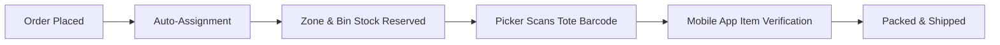

# Magento 2 Warehouse Management System

The **Webkul Magento 2 Warehouse Management System (WMS)** transforms standard Adobe Commerce / Magento 2 stores into a multi-facility fulfillment engine. It maps catalog product inventory to exact physical bin locations, maintains real-time bin stock status (`available`, `reserved`, `picked`, `packed`), automates order assignment to warehouse pickers, and connects with mobile scanner apps via GraphQL and REST APIs.

WMS is architected **strictly on top of Magento Multi-Source Inventory (MSI)**. It projects physical location tracking above your configured inventory sources without altering MSI source tables directly, completely eliminating double-counting and salable quantity discrepancies.

  <a href="https://store.webkul.com/Magento2-Warehouse-Management-System.html" target="_blank" rel="noopener">Buy Now</a>
  &nbsp;·&nbsp;
  <a href="https://webkul.uvdesk.com/" target="_blank" rel="noopener">Support</a>

## Core Capabilities

- **5-Tier Storage Hierarchy:** Organize each facility into Warehouses, Zones, Rows, Shelves, Racks, and Bins with capacity constraints.
- **MSI Source Synchronization:** Pair physical warehouses directly with Magento MSI sources for end-to-end inventory accuracy.
- **Automated Order Assignment:** Route new orders (`checkout_submit_all_after`) straight to designated warehouse pickers based on product location and staff zone scoping.
- **4-State Stock Reservation:** Track item status at the physical bin level: `available` &rarr; `reserved` &rarr; `picked` &rarr; `packed`.
- **Reusable Physical Totes:** Manage barcoded totes linked to orders during active picking and automatically released for reuse upon shipment or cancellation.
- **Code128 Barcode Printing:** Generate and mass-print compliant barcodes for products, totes, and bin slots.
- **Mobile Warehouse App Integration:** Equip floor pickers with high-speed GraphQL and REST endpoints, complete with Firebase Cloud Messaging (FCM) real-time push alerts.

## Where to Go Next

| Area | What it covers | Guide |
| --- | --- | --- |
| Requirements | PHP versions, Magento editions, MSI, and Imagick dependencies | [Open requirements](/requirements.html) |
| Installation | Composer installation, database schema, and queue consumer setup | [Open installation](/installation.html) |
| Activation | License key activation and master module enablement | [Open activation](/activation.html) |
| Configuration | Auto-assignment, API tokens, and Firebase push alerts | [Open configuration](/configuration/overview.html) |
| Warehouse Setup | Creating warehouses, zone allocation, and interactive bin grids | [Open warehouse setup](/features/warehouse-management.html) |
| Staff & Picking | Managing staff pickers, order routing, and tote picking | [Open staff management](/features/staff-management.html) |
