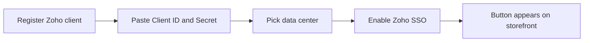

# Configuration Overview

All settings live on one page:

**Stores → Configuration → Webkul → Zoho SSO**

Once the module is enabled you can also reach it from **Zoho SSO → Configuration** in the
admin sidebar.

The page has two groups:

| Group | What it holds |
| --- | --- |
| **Zoho SSO (OIDC) Settings** | Every setting the extension uses. |
| Module information | Author, user guide, store page, support ticket, services links, and the installed version. Its heading currently reads "Spin To Win Information" — a label slip; it is the Zoho SSO information block. |

## The settings at a glance

| Setting | Default | Required |
| --- | --- | --- |
| Enable Zoho SSO | No | Yes |
| Zoho Data Center / Region | United States (.com) | Yes |
| Zoho Client ID | — | Yes |
| Zoho Client Secret | — | Yes |
| Zoho OAuth API Version | v2 | Yes |
| Authorized Redirect URI (Copy for Zoho Console) | auto-detected | Display only |
| Custom Redirect URI (Optional) | — | No |
| Default Customer Group for New Accounts | General | No |

Details for each field: [Settings Reference](./settings.md).

