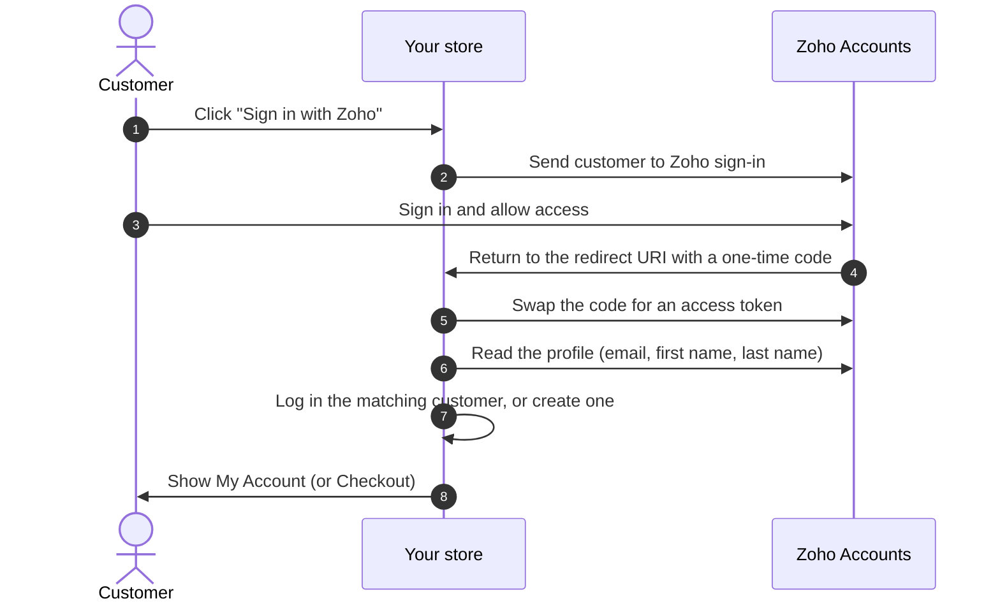

# How It Works

## Step by step

1. The customer clicks the Zoho button. On desktop it opens a popup; on touch devices the
   current tab goes to Zoho.
2. Your store creates a random one-time **state** value, keeps it in the customer's
   session, and sends the customer to your region's Zoho Accounts server.
3. The customer signs in to Zoho and approves the requested access: `openid`, `profile`,
   `email`, and `Aaaserver.profile.READ`.
4. Zoho sends the customer back to your **Authorized Redirect URI** with a one-time code.
5. Your store checks that the returned state matches the one it stored. A mismatch stops
   the sign-in.
6. The server exchanges the code — together with your Client ID and Client Secret — for an
   access token, and reads the customer's Zoho profile.
7. The store logs in the customer whose email matches on this website, or creates a new
   customer in your **Default Customer Group for New Accounts**.
8. The customer lands on **My Account**, or back on **Checkout** if they started there.
   In a popup, the popup closes itself and the main window moves on.

## What Zoho shares with your store

| Field | Used for |
| --- | --- |
| Email | Finding or creating the customer. **Required.** |
| First name | New customer's first name. Falls back to `Zoho`. |
| Last name | New customer's last name. Falls back to `User`. |

Nothing else from the Zoho profile is stored. The access token is used once and is not
saved.

Next: [Requirements](./installation/requirements.md).
