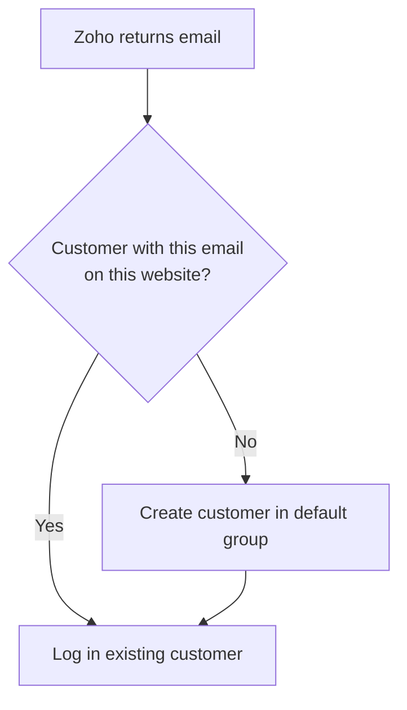

# Accounts & Matching

Every Zoho sign-in ends in one of two ways.

## Matching is by email and website

The extension looks for a customer with the **same email** on the **current website**.

- **Found** — that customer is logged in. Their name, group, addresses, and orders are not
  changed.
- **Not found** — a new customer is created with the Zoho email and name, in the
  **Default Customer Group for New Accounts**, then logged in.

## Customers who already have a password

A customer who registered with a password and later uses **Sign in with Zoho** with the
same email is logged in to their existing account. Both methods work for them afterwards.

::: warning Email is the only link
Zoho SSO trusts the email address Zoho returns. Anyone who controls a Zoho account with a
given email can sign in to the Magento account with that email. Zoho accounts are
email-verified, but if you allow Zoho sign-in from organisations whose email addresses you
do not trust, keep this in mind.
:::

## Multiple websites

With **Share Customer Accounts = Per Website**, each website has its own customers. The
same Zoho user signing in on two websites gets one account per website. With **Global**
sharing, one account is used everywhere.

## What is not synced

Only email, first name, and last name are read, and only when the account is created.
Later changes to the Zoho profile are not copied to Magento, and nothing is written back to
Zoho.

## Welcome emails

Accounts created through Zoho are saved directly; Magento's "Welcome" account email is not
sent.

Next: [Messages](./messages.md).
