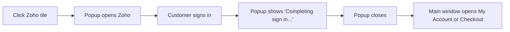

# Popup & Mobile Behaviour

The Zoho tile picks how to open Zoho based on the device.

| Situation | What happens |
| --- | --- |
| Desktop browser | Zoho opens in a centred **500 × 640** popup. Your page stays open behind it. |
| Phone or tablet (touch screen, no hover) | The current tab goes to Zoho and comes back. |
| Popup blocked by the browser | Falls back to the same-tab flow automatically. |
| JavaScript unavailable | The tile is a normal link, so the same-tab flow still works. |

## The popup flow

After Zoho returns, the popup briefly shows **Completing sign in...**, tells the main
window where to go, and closes itself. The main window then loads **My Account**, the
**Checkout**, or — if sign-in failed — the page with the error message.

If the main window was closed in the meantime, the popup itself goes to that page instead.
A **Continue** link is shown as a manual fallback.

## Security

- The popup only talks to a main window on **your own store's origin**.
- The final destination is limited to **My Account**, **Customer Login**, or **Checkout**.
  The popup cannot be used to send customers to another site.
- A random one-time **state** value is checked on every return from Zoho, so a forged
  callback is rejected.

Next: [Accounts & Matching](./accounts.md).
